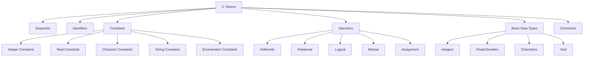

## Data, Variables, and Constants in C

### C Tokens

In C programming, a token is the smallest individual unit in a program. C tokens can be classified into several categories:

- Keywords
- Identifiers
- Constants
- Operators
- Special symbols
- Comments

All these tokens combined together form a C program. The compiler processes these tokens sequentially to understand the program's structure and functionality.

### Keywords

Keywords are predefined reserved words in C that have special meanings to the compiler. They cannot be used as identifiers or variable names. Some of the keywords in C include:

- `auto`
- `break`
- `case`
- `char`
- `const`
- `continue`
- `default`
- `do`
- `double`
- `else`
- `enum`
- `extern`
- `float`
- `for`
- `goto`
- `if`
- `int`
- `long`
- `register`
- `return`
- `short`
- `signed`
- `sizeof`
- `static`
- `struct`
- `switch`
- `typedef`
- `union`
- `unsigned`
- `void`
- `volatile`
- `while`

Total number of keywords in C is 32. The exact set of keywords may vary slightly between different C standards like C89, C99, C11, etc.

### Identifiers

Identifiers are names given to variables, functions, arrays, or other user-defined items. They are used to identify different elements in a program. Rules for forming identifiers in C include:

1. Allowed characters: letters (A-Z, a-z), digits (0-9), and underscore (_)
2. First character must be a letter or underscore (not a digit)
3. Cannot contain spaces or special characters (except underscore)
4. Cannot be a keyword
5. Case-sensitive (variables 'sum' and 'Sum' are different)

Examples of valid identifiers:

- `variable_name`
- `sum`
- `total_marks`
- `average`
- `_temp`

Examples of invalid identifiers:

- `2number` (starts with digit)
- `my variable` (contains space)
- `int` (keyword)
- `sum@total` (contains special character)

### Constants

Constants are fixed values that cannot be changed during program execution. They are also called literals. Constants in C can be of several types:

1. Integer constants
2. Real constants (floating-point constants)
3. Character constants
4. String constants
5. Enumeration constants

Constants provide several advantages:

- They make the program more readable and maintainable
- They prevent accidental modification of values that should remain unchanged
- They improve program efficiency as compilers can optimize constant values

### Operators

Operators are symbols that perform operations on variables and values. They are essential for manipulating data and controlling program flow. C operators can be classified into:

1. Arithmetic operators: `+`, `-`, `*`, `/`, `%`, `++`, `--`
2. Relational operators: `==`, `!=`, `>`, `<`, `>=`, `<=`
3. Logical operators: `&&`, `||`, `!`
4. Bitwise operators: `&`, `|`, `^`, `~`, `<<`, `>>`
5. Assignment operators: `=`, `+=`, `-=`, `*=`, `/=`, `%=`, etc.
6. Conditional operator: `?:`
7. Special operators: `sizeof`, `&` (address), `*` (pointer), `.` (member), `->` (pointer to member)

The precedence of operators determines the order in which operations are performed. Higher precedence operators are evaluated before lower precedence operators.

### Basic Data Types in C

Data types in C determine the type of data a variable can store, the amount of memory it occupies, and the operations that can be performed on it. The basic data types in C include:

#### Integers

Integers are whole numbers without fractional components. They can be positive, negative, or zero. In C, integer types include:

- `char`: Typically 1 byte, stores characters or small integers
- `short`: Usually 2 bytes
- `int`: Typically 4 bytes
- `long`: Usually 4 bytes
- `long long`: Usually 8 bytes

Each integer type can also be modified with the `signed` or `unsigned` keyword to determine if they can store negative values.

#### Floats and Doubles

Floating-point types represent real numbers with fractional parts:

- `float`: Single-precision floating-point, typically 4 bytes
- `double`: Double-precision floating-point, typically 8 bytes
- `long double`: Extended precision floating-point, typically 10 or 16 bytes

Floating-point types follow the IEEE 754 standard for representing real numbers in binary.

#### Characters

Character type (`char`) stores single characters such as letters, digits, or special symbols. Characters are stored as their corresponding ASCII values. For example, the character 'A' is stored as the value 65.

The `char` type is typically 1 byte in size and can be modified with `signed` (values from -128 to 127) or `unsigned` (values from 0 to 255).

#### Void

The `void` type indicates an absence of value. It has several uses:

1. Function return type: Functions that don't return a value use `void`
2. Function parameters: Functions that don't take parameters use `void`
3. Generic pointers: A `void*` pointer can point to any data type

Example:
```c
void print_message() {
    printf("Hello, World!");
}
```

### Size and Range of Values of Data Types

The size of data types can vary between different systems. The C standard specifies minimum sizes but allows implementations to exceed them. Below are typical sizes and ranges for modern 32-bit and 64-bit systems:

| Data Type | Size (bytes) | Range (typical) |
|-----------|-------------|-----------------|
| `char` | 1 | -128 to 127 (signed) or 0 to 255 (unsigned) |
| `short` | 2 | -32,768 to 32,767 (signed) or 0 to 65,535 (unsigned) |
| `int` | 4 | -2,147,483,648 to 2,147,483,647 (signed) or 0 to 4,294,967,295 (unsigned) |
| `long` | 4 or 8 | On 32-bit: same as int; On 64-bit: -9,223,372,036,854,775,808 to 9,223,372,036,854,775,807 |
| `long long` | 8 | -9,223,372,036,854,775,808 to 9,223,372,036,854,775,807 |
| `float` | 4 | ±3.4E±38 (about 7 decimal digits) |
| `double` | 8 | ±1.7E±308 (about 15 decimal digits) |
| `long double` | 10 or 16 | ±1.2E±4932 (about 19 decimal digits) |

You can use the `sizeof` operator to determine the size of data types on your system:

```c
printf("Size of int: %zu bytes\n", sizeof(int));
printf("Size of float: %zu bytes\n", sizeof(float));
```

### Variables

Variables are named storage locations in memory that hold data values that can change during program execution. They are fundamental to programming as they allow us to store and manipulate data.

#### Characteristics of Variables

1. Name: A unique identifier for the variable
2. Data type: Determines the kind of data the variable can hold
3. Size: Amount of memory allocated to store the variable
4. Value: The data stored in the variable
5. Address: The memory location where the variable is stored

#### Declaration of Variables

Variable declaration specifies the name and data type of a variable. The syntax is:

```c
data_type variable_name;
```

Example:
```c
int age;
float average;
char grade;

int a, b, c; // Multiple variables of same type
```

#### Initialization of Variables

Initialization is the process of assigning an initial value to a variable when it is declared. The syntax is:

```c
data_type variable_name = value;
```

Example:
```c
int age = 25;
float average = 85.5;
char grade = 'A';

int a = 10, b = 20, c = 30; // Multiple initialization
```

#### Assigning Values to Variables

You can assign or change a variable's value using the assignment operator (`=`):

```c
int age;
age = 25; // Assignment after declaration

// You can also use compound assignment operators
age += 5; // Equivalent to age = age + 5
age *= 2; // Equivalent to age = age * 2
```

Constants are fixed values that cannot be changed during program execution. They are useful for values that should remain constant throughout the program.

#### Types of Constants

1. Integer Constants
2. Real Constants (Floating-point Constants)
3. Character Constants
4. String Constants

#### Integer Constants

Integer constants are whole numbers without fractional components. They can be:

1. Decimal: Base 10 (digits 0-9)
   ```c
   int a = 123;
   int b = +456;
   int c = -789;
   ```

2. Octal: Base 8 (digits 0-7), prefixed with 0
   ```c
   int a = 0123; // Decimal 83
   ```

3. Hexadecimal: Base 16 (digits 0-9, letters A-F), prefixed with 0x or 0X
   ```c
   int a = 0x123; // Decimal 291
   ```

Integer constants can also have the following suffixes to specify their type:

- `U` or `u`: unsigned
- `L` or `l`: long
- `LL` or `ll`: long long
- `UL` or `ul`: unsigned long
- `ULL` or `ull`: unsigned long long

Examples:
```c
unsigned int a = 123U;
long b = 123L;
long long c = 123LL;
unsigned long d = 123UL;
```

#### Real Constants

Real constants (floating-point constants) represent numbers with fractional parts. They can be:

1. Decimal form: With a decimal point and optional exponent
   ```c
   float a = 123.456;
   float b = 0.456;
   float c = -123.0;
   float d = .456; // Equivalent to 0.456
   ```

2. Exponential form: With an exponent (E or e)
   ```c
   float a = 123.456e2; // 123.456 × 10² = 12345.6
   float b = 123.456E-2; // 123.456 × 10⁻² = 1.23456
   ```

Floating-point constants can have the following type specifiers:

- `F` or `f`: float
- `L` or `l`: long double

Examples:
```c
float a = 123.456F;
double b = 123.456;
long double c = 123.456L;
```

#### Character Constants

Character constants are single characters enclosed in single quotes:
```c
char a = 'A';
char b = '7';
char c = '$';
char d = '\n'; // Newline escape sequence
```

Special characters can be represented using escape sequences:

- `\n`: Newline
- `\t`: Tab
- `\\`: Backslash
- `\'`: Single quote
- `\"`: Double quote
- `\b`: Backspace
- `\r`: Carriage return
- `\0`: Null character
- `\xHH`: Hexadecimal number (HH is hex digits)
- `\0OO`: Octal number (OO is octal digits)

Examples:
```c
char newline = '\n';
char backslash = '\\';
char hex_value = '\x41'; // 'A' in ASCII
```

#### String Constants

String constants (string literals) are sequences of characters enclosed in double quotes. The compiler automatically adds a null character (`\0`) at the end:
```c
char greeting[] = "Hello, World!";
char name[] = "John Doe";
char empty[] = ""; // Empty string
```

Each string character occupies one byte, and the null terminator occupies one additional byte.

### Declaration and Initialization of Variables and Constants

#### Declaration of Variables

Variable declaration tells the compiler the name and data type of a variable. The variable is declared before it is used:

```c
int age; // Declaration
age = 25; // Assignment
```

Multiple variables of the same type can be declared in one statement:
```c
int a, b, c;
```

#### Initialization of Variables

Initialization assigns an initial value to a variable when it is declared:

```c
int age = 25; // Declaration and initialization
```

For multiple variables:
```c
int a = 10, b = 20, c = 30;
```

Uninitialized variables contain garbage values (undefined values), which can lead to unpredictable behavior. It's always good practice to initialize variables when declaring them.

#### Constants Declaration

Constants can be declared in two ways in C:

1. Using `const` keyword
   ```c
   const int MAX_VALUE = 100;
   const float PI = 3.14159;
   ```

2. Using `#define` preprocessor directive
   ```c
   #define MAX_VALUE 100
   #define PI 3.14159
    ```

Constants declared with `const` are type-safe (the compiler knows their data type), while constants defined with `#define` are simple text substitutions during preprocessing.

### Assigning Values to Variables

Values can be assigned to variables in several ways:

#### Simple Assignment

The basic assignment operator is `=`:
```c
int a;
a = 10; // Simple assignment

// Compound assignment
a += 5; // a = a + 5
a -= 3; // a = a - 3
a *= 2; // a = a * 2
a /= 4; // a = a / 4
a %= 2; // a = a % 2
```

#### Multiple Assignment

Multiple variables can be assigned the same value:
```c
int a, b, c;
a = b = c = 10; // All assigned 10
```

#### Initialization During Declaration

Variables can be initialized at the time of declaration:
```c
int a = 10;
int b = 20, c = 30;
```

#### Initialization with Expressions

Variables can be initialized with expressions involving other variables or constants:
```c
int a = 10;
int b = a + 5; // b is 15
int c = 2 * b; // c is 30
```

#### Type Conversion in Assignment

When assigning values between different data types, type conversion may occur:

1. Implicit type conversion: Done automatically by the compiler
   ```c
   int a = 10;
   float b = a; // int to float (a becomes 10.0)
   ```

2. Explicit type conversion: Done using cast operator
   ```c
   float a = 10.5;
   int b = (int)a; // float to int (b becomes 10)
   ```

When converting from a larger type to a smaller type (like double to float), data may be lost due to truncation or rounding.


(insert image on C data types memory representation here)
