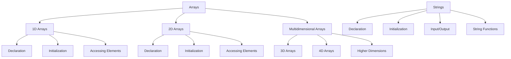
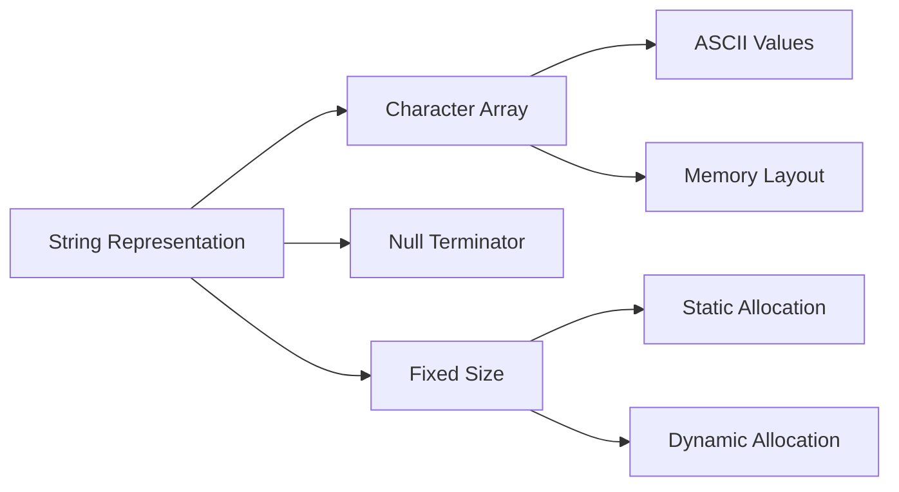

## Arrays in C

### What are Arrays?
Arrays are a collection of elements of the same data type stored in contiguous memory locations. They provide a way to store multiple values of the same type under a single variable name, using an index to access each element.

### Declaration of Arrays
The general syntax for declaring an array in C is:

```c
data_type array_name[array_size];
```

Where:

- `data_type` specifies the type of elements the array will hold (e.g., int, float, char)
- `array_name` is the name of the array
- `array_size` indicates the number of elements the array can hold

Examples:
```c
int numbers[10];      // An array of 10 integers
float prices[5];      // An array of 5 floating-point numbers
char letters[26];     // An array of 26 characters
```

### Initialization of Arrays
Arrays can be initialized at the time of declaration in several ways:

1. **Initialization with explicit values:**
```c
int marks[5] = {90, 85, 95, 88, 92};
```

2. **Partial initialization:**
```c
int numbers[10] = {1, 2, 3};  // Remaining elements will be set to 0
```

3. **Initialization without size (compiler determines size):**
```c
int primes[] = {2, 3, 5, 7, 11};  // Array size is 5
```

4. **Initialization using loops:**
```c
int squares[10];
for(int i = 0; i < 10; i++) {
    squares[i] = i * i;
}
```

### Accessing Array Elements
Array elements are accessed using their index number, which starts from 0 in C. The syntax is:

```c
array_name[index];
```

Examples:
```c
int scores[3] = {95, 88, 76};
printf("%d", scores[0]);  // Outputs 95
scores[2] = 90; // Changes the third element to 90
```

[insert image on array index visualization here]

**Important Notes:**

- Array indices in C start from 0, not 1
- The valid index range is 0 to (size-1)
- Accessing an out-of-bounds index leads to undefined behavior
- The compiler does not check array bounds automatically

## Multidimensional Arrays

### What are Multidimensional Arrays?
Multidimensional arrays are arrays of arrays, allowing you to create tables or matrices of data. The most common type is the two-dimensional array (2D array), which represents a table with rows and columns.

### Declaration of Multidimensional Arrays
The general syntax for declaring a multidimensional array is:

```c
data_type array_name[size1][size2]...[sizeN];
```

For a 2D array:
```c
int matrix[3][4];  // 3 rows, 4 columns
float table[5][5];  // 5x5 matrix
```

### Initialization of Multidimensional Arrays
2D arrays can be initialized in several ways:

1. **Row-wise initialization:**
```c
int matrix[2][3] = {
    {1, 2, 3},
    {4, 5, 6}
};
```

2. **Linear initialization (in memory order):**
```c
int matrix[2][3] = {1, 2, 3, 4, 5, 6};
```

3. **Partial initialization:**
```c
int matrix[2][3] = {
    {1, 2},
    {4}
};  // Remaining elements are initialized to 0
```

### Accessing Elements in Multidimensional Arrays
Elements are accessed using multiple indices:

```c
matrix[1][2] = 10;  // Accesses element in row 1, column 2
printf("%d", matrix[0][1]);  // Outputs element in row 0, column 1
```

[insert image on 2D array visualization here]

### More Than Two Dimensions
C supports arrays with any number of dimensions:

```c
int cube[3][4][5];  // 3D array
int hypercube[3][4][5][6];  // 4D array
```

## Strings in C

### What are Strings in C?
In C, a string is a sequence of characters terminated by a null character ('\0'). Unlike some other languages, C does not have a built-in string type. Instead, strings are represented as arrays of characters.

### Declaration and Initialization of Strings
Strings can be declared and initialized in several ways:

1. **As a character array:**
```c
char greeting[6] = {'H', 'e', 'l', 'l', 'o', '\0'};
```

2. **Using string literal:**
```c
char greeting[] = "Hello";  // Size is 6 (including null terminator)
```

3. **declaration with specific size:**
```c
char name[50] = "John Doe";  // Can hold up to 49 characters + null terminator
```

[insert image on string null terminator here]

### String Input and Output in C
C provides several functions for string input and output in the standard library `<string.h>` and `<stdio.h>`.

#### String Output Functions
1. **`puts()` function:**
```c
char message[] = "Hello, World!";
puts(message);  // Outputs the string and adds a newline
```

2. **`printf()` function with `%s` format specifier:**
```c
char name[] = "Alice";
printf("Hello, %s!", name);
```

3. **`fputs()` function for file output:**
```c
fputs("Output to file", stdout);
```

#### String Input Functions

1. **`gets()` function (deprecated - dangerous):**
```c
char buffer[100];
gets(buffer);  // Reads until newline, but doesn't check buffer size
```

2. **`fgets()` function (safer alternative):**
```c
char buffer[100];
fgets(buffer, 100, stdin);  // Reads up to 99 characters + null terminator
```

3. **`scanf()` function with `%s`:**
```c
char name[50];
scanf("%s", name);  // Stops reading at whitespace
```

4. **`gets()` alternative with length limitation:**
```c
char input[100];
int i = 0;
while(i < 99 && (input[i] = getchar()) != '\n') {
    i++;
}
input[i] = '\0';
```

### Important String Functions
The `<string.h>` header provides many useful string functions:

- `strlen()`: Returns the length of a string
- `strcpy()`: Copies one string to another
- `strcat()`: Concatenates two strings
- `strcmp()`: Compares two strings
- `strncpy()`: Copy with maximum length
- `strncat()`: Concatenate with maximum length
- `sprintf()`: Formatted string output

Example usage:
```c
#include <string.h>
char str1[50] = "Hello";
char str2[50] = "World";
printf("Length of str1: %zu\n", strlen(str1));
strcpy(str2, str1);  // Copy str1 to str2
strcat(str1, " C");  // "Hello C"
int cmp = strcmp(str1, str2);  // Non-zero if strings are different
```

### String Manipulation Best Practices
1. Always ensure strings have space for the null terminator
2. Be careful about buffer overflows when copying strings
3. Check string length before copying to destination buffer
4. Initialize strings properly to avoid undefined behavior
5. Consider using safer string functions like `strncpy()` and `strncat()`




