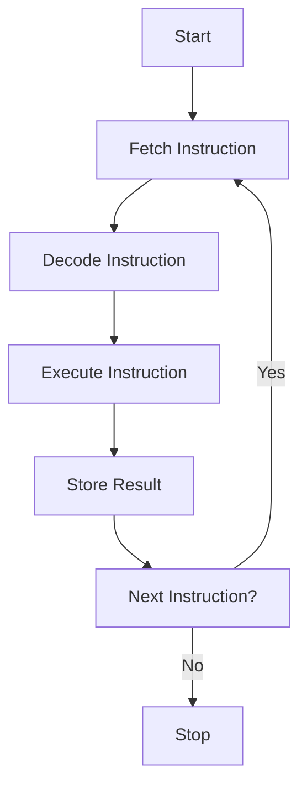
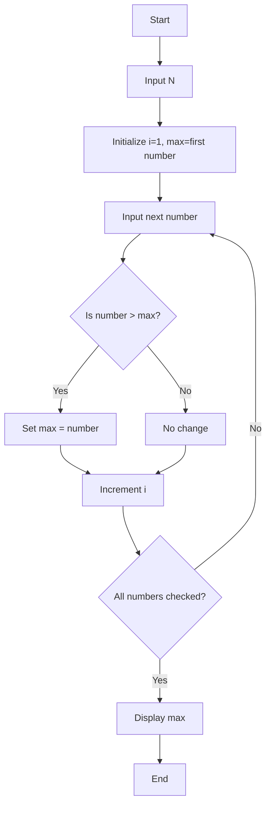
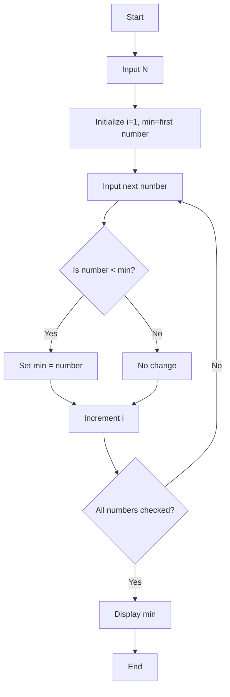
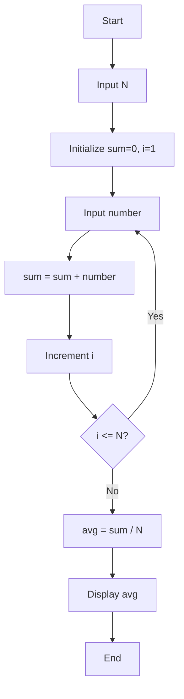
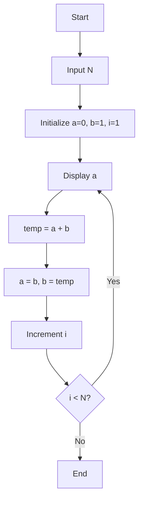
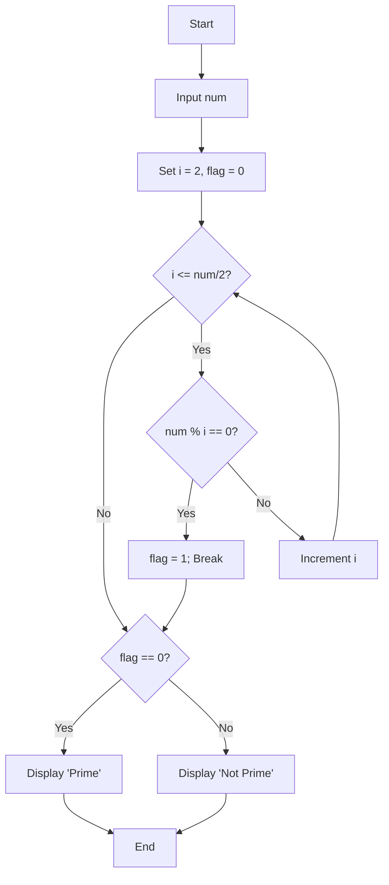

# CPU and Instruction Cycle

## Control Unit (CU)

The **Control Unit (CU)** is a critical component of the **Central Processing Unit (CPU)** that directs the operation of the processor.  
It coordinates all the activities of the computer system by interpreting instructions and controlling the flow of data between the CPU and other components.

### Functions of the Control Unit
- Fetches instructions from memory.
- Decodes instructions to determine the operation to perform.
- Directs the ALU (Arithmetic Logic Unit) and registers to execute instructions.
- Manages timing and control signals for the CPU and peripherals.
- Controls the movement of data within the CPU and between the CPU and memory or I/O devices.

---

## Computer Instruction Set

An **instruction set** is the collection of instructions that a CPU can execute. Each instruction tells the processor what operation to perform.

### Types of Instructions
- **Data Transfer Instructions:** Move data between registers, memory, and I/O devices.  
  Example: `MOV A, B`
- **Arithmetic Instructions:** Perform arithmetic operations.  
  Example: `ADD A, B`
- **Logical Instructions:** Perform logical operations such as AND, OR, NOT.  
  Example: `AND A, B`
- **Control Transfer Instructions:** Change the sequence of execution.  
  Example: `JUMP`, `CALL`, `RETURN`
- **Input/Output Instructions:** Handle data transfer between CPU and I/O devices.  
  Example: `IN`, `OUT`

---

## Instruction Execution Life Cycle

The **Instruction Cycle** is the process by which a CPU retrieves and executes an instruction.

### Stages of Instruction Cycle

#### 1. Fetch
- The control unit fetches the next instruction from memory.
- The address of the instruction is stored in the **Program Counter (PC)**.
- The instruction is loaded into the **Instruction Register (IR)**.

#### 2. Decode
- The CU interprets the fetched instruction to understand what operation to perform.

#### 3. Execute
- The decoded instruction is executed using the ALU and registers.

#### 4. Store
- The result of execution is written back to memory or a register.

### Instruction Cycle Flowchart



---

# Programming Concepts

## Program

A **program** is a set of instructions written in a programming language that performs a specific task when executed by a computer.

## Algorithm

An **algorithm** is a step-by-step procedure or formula for solving a problem.
It is written in natural or structured language and must be:

* Finite (has an end)
* Definite (clear and unambiguous)
* Effective (produces the desired result)

## Pseudocode

**Pseudocode** is a way of expressing algorithms using a mixture of natural language and programming constructs.
It helps in designing algorithms without worrying about syntax.

**Example:**

```
Start
Input A, B
Sum = A + B
Display Sum
End
```

## Flowchart

A **flowchart** is a graphical representation of an algorithm using symbols to represent operations and arrows to show the flow of control.

### Common Symbols

| Symbol | Meaning             |
| ------ | ------------------- |
| ⭘      | Start/End           |
| ⬛      | Process/Computation |
| ⧫      | Decision/Condition  |
| ⬒      | Input/Output        |
| ⟶      | Flow Line           |

---

# Programming Languages

## Machine Level Language

* Written in binary code (0s and 1s).
* Directly executed by the CPU.
* Very fast but difficult to write and understand.
* Hardware-dependent.

**Example:**
`10110000 01100001`

---

## Assembly Language (Low-Level)

* Uses **mnemonics** instead of binary.
* Easier to understand than machine language.
* Requires an **Assembler** to convert to machine code.
* Hardware-dependent.

**Example:**
`MOV A, B`

---

## High-Level Language

* Uses human-readable syntax.
* Portable across different hardware.
* Requires a **Compiler** or **Interpreter**.
* Examples: C, Python, Java, C++, JavaScript.

**Example (Python):**

```python
a = 5
b = 10
sum = a + b
print(sum)
```

---

# Language Translators

| Translator      | Function                                                     | Example      |
| --------------- | ------------------------------------------------------------ | ------------ |
| **Assembler**   | Converts Assembly Language to Machine Language               | NASM, MASM   |
| **Compiler**    | Converts entire High-Level Program into Machine Code at once | GCC, Clang   |
| **Interpreter** | Translates and executes High-Level Code line by line         | Python, Ruby |

---

# Flowchart Examples

## Find the Maximum of N Numbers



---

## Find the Minimum of N Numbers



---

## Find the Average of N Numbers



---

## Display First N Terms of Fibonacci Series



---

## Check if a Number is Prime



---

# Software

## Application Software

**Definition:**
Software designed to perform specific user-oriented tasks.

**Examples:**

* Microsoft Word (Word Processing)
* Adobe Photoshop (Image Editing)
* VLC Media Player (Media Playback)
* Google Chrome (Web Browsing)

---

## System Software

**Definition:**
Software designed to control and manage computer hardware and to provide a platform for running application software.

**Examples:**

* Windows OS, Linux OS
* Device Drivers
* Utility Programs (e.g., Disk Management Tools)

---

## Operating System (OS)

An **Operating System** is system software that manages hardware resources and provides common services for computer programs.

### Functions:

* Process Management
* Memory Management
* File System Management
* Device Management
* User Interface

**Examples:** Windows, macOS, Linux, Android

---

## Device Driver

A **Device Driver** is a program that allows the OS to communicate with hardware devices.

**Examples:**

* Printer Driver
* Graphics Card Driver
* Network Adapter Driver

---

## Open-Source vs. Proprietary Software

| Type                     | Definition                                                           | Example                                  |
| ------------------------ | -------------------------------------------------------------------- | ---------------------------------------- |
| **Open-Source Software** | Source code is available publicly for modification and distribution. | Linux, Apache, LibreOffice               |
| **Proprietary Software** | Source code is owned and restricted by the developer or company.     | Microsoft Office, Adobe Photoshop, macOS |

---

